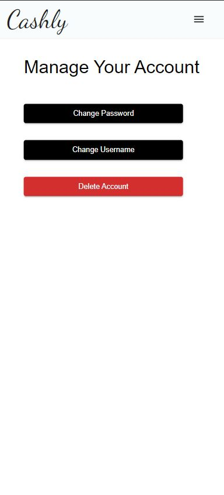

# Cashly - Personal Expense Tracker

Welcome to **Cashly**, a simple and intuitive expense tracker built using **React**, **Material UI**, and **.NET Core Web API**. Cashly helps you track your daily, weekly, and monthly expenses, categorize them, and visualize your spending patterns with interactive charts.

## Features

- 📊 **Dashboard**: Visualize your expenses with charts and get an overview of your spending habits.
- 📝 **Expense History**: Track and manage your daily expenses.
- 🗂 **Categories**: Organize your expenses into categories like food, utility, transport, and more.
- 🔐 **JWT Authentication**: Secure login and registration system.
- 📅 **Monthly Reports**: View a detailed breakdown of your expenses for the past 30 days.

## Tech Stack

- **Frontend**: React.js, Material UI, Chart.js
- **Backend**: ASP.NET Core Web API, Entity Framework Core
- **Database**: SQL Server
- **Authentication**: JWT (JSON Web Tokens)

## Screenshots

### Landing Page

### Home Page

### Home Page

### Reports Page

### Settings Page

